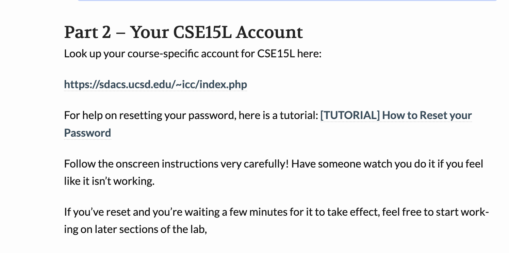
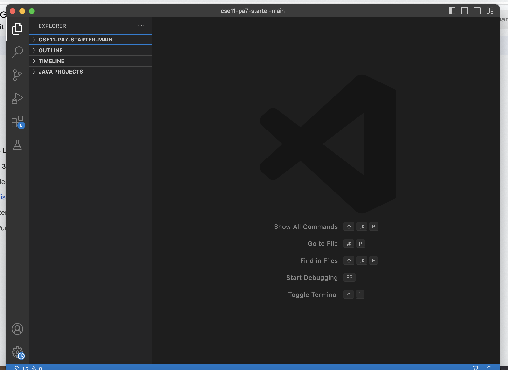
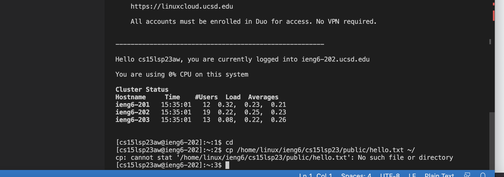
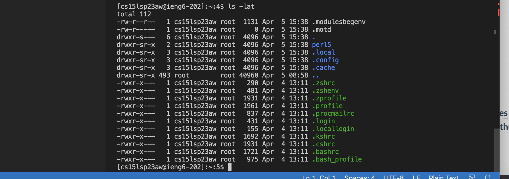

Remote Access steps:

1. Go to the course webite, and click the link for the course account lookup.

2. In the website type in your username and PID number to lookup your account username

3. Upon finding it, set the password for that account, follow the on screen instructions and a link should be sent to your personal email to set up your new password.
4. After setting up the password, wait for it to take effect and in the meantime download vscode(i already had it downloaded)

5. Open up a new terminal, and type in $ ssh cs15lsp23zz@ieng6.ucsd.edu where zz is your username letter
6. The terminal should prompt you for your password, enter the password you just created and log in
7. You Should now be connected.

7. You Should now be connected, try out different commands.

