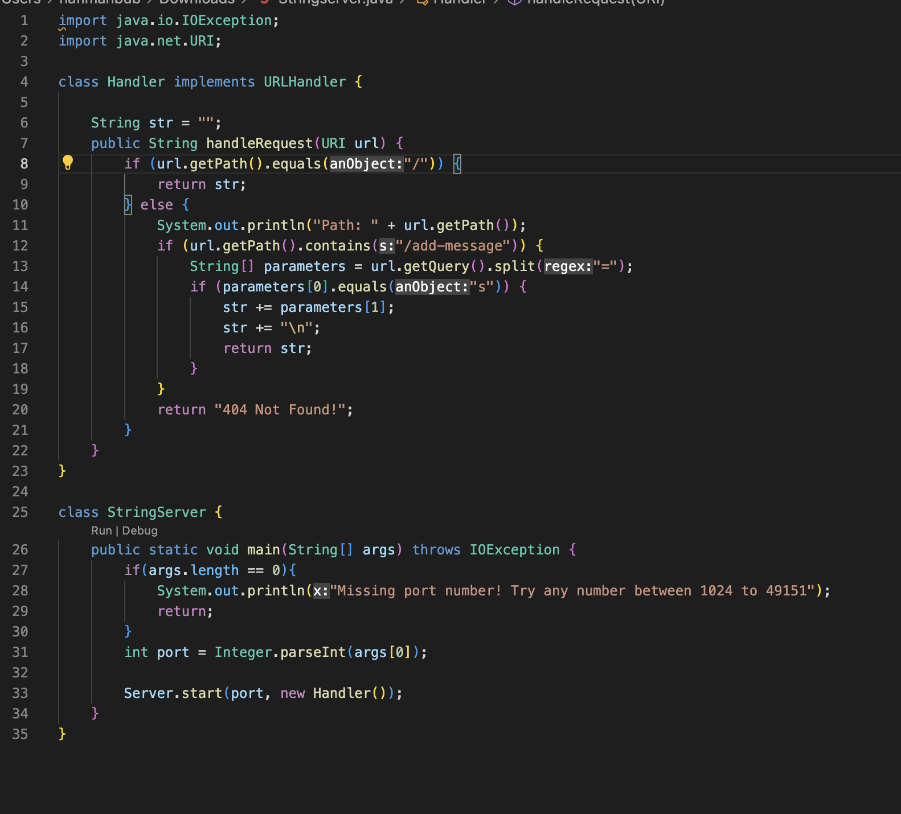
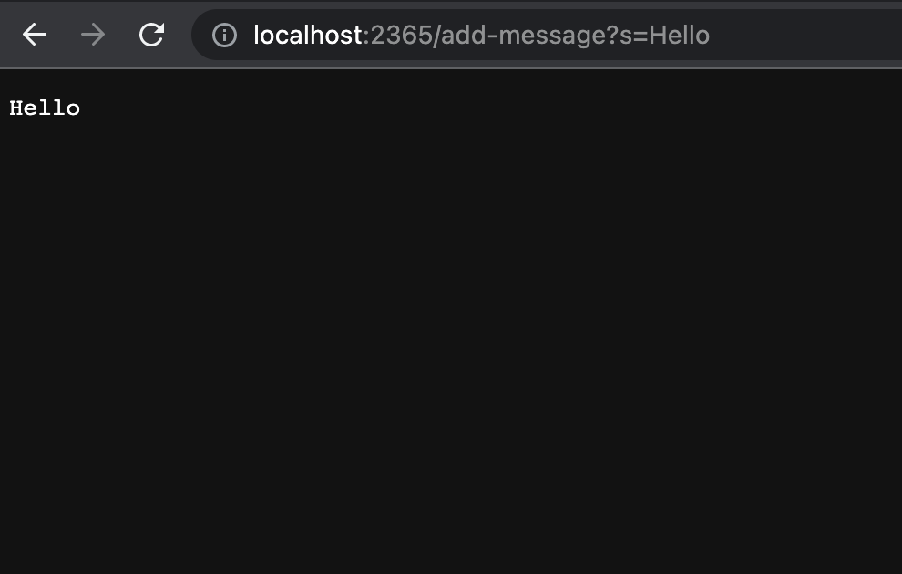
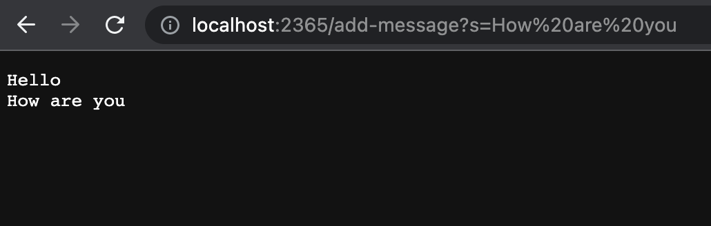
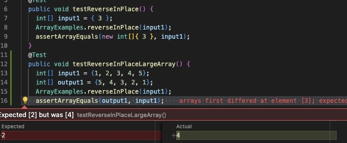

LabReport 2 : Nafi Mahbub


PART 1
1) StringServer Code:


2) hello

handleRequest method is called,
the relevant arguement:
```if (url.getPath().contains("/add-message")) {
  String[] parameters = url.getQuery().split("=");
  if (parameters[0].equals("s")) {
    str += parameters[1];
    str += "\n";
    return str;
  }
}
```

Str is the relevant class instance.The String[] parameters and method parameter url changed
The method parameter url changed since a different url is entered: http://localhost:2365/add-message?s=Hello
The value parameters represent the query part of the url. Since the url changed, the parameters also changed to {"s", "Hello"}
The class instance str changed since we are adding the part of query to str so that it could display on the website. The new str would be "Hello\n"

3) how are you 

handleRequest method is called,
the relevant arguement:
```if (url.getPath().contains("/add-message")) {
  String[] parameters = url.getQuery().split("=");
  if (parameters[0].equals("s")) {
    str += parameters[1];
    str += "\n";
    return str;
  }
}
```
Str is the relevant class instance.The String[] parameters and method parameter url changed
The method parameter url changed since a different url is entered: which is http://localhost:2365/add-message?s=How are you
The value parameters represent the query part of the url. Since the url changed, the parameters also changed to {"s", "How are you"}
The class instance str changed since we are adding the part of query to str so that it could display on the website. The new str would be "Hello\nHow are you\n"

PART 2
Bug:
 ``` static int[] reversed(int[] arr) {
    int[] newArray = new int[arr.length];
    for(int i = 0; i < arr.length; i += 1) {
      arr[i] = newArray[arr.length - i - 1];
    }
    return arr;
  }
  ```
  Failure-inducing input:
 ``` @Test
public void testReverseInPlaceLargeArray() {
   int[] input1 = {1, 2, 3, 4, 5};
   int[] output1 = {5, 4, 3, 2, 1};
   ArrayExamples.reverseInPlace(input1);
   assertArrayEquals(output1, input1);
}
```
Input not inducing failure:
```@Test 
public void testReverseInPlace() {
  int[] input1 = { 3 };
  ArrayExamples.reverseInPlace(input1);
  assertArrayEquals(new int[]{ 3 }, input1);
  ```

Symptom:



Desired output: 5, 4, 3, 2, 1

Actual Output: 5, 4, 3, 4, 5

Before:
```static void reverseInPlace(int[] arr) {
    for(int i = 0; i < arr.length; i += 1) {
        arr[i] = arr[arr.length - i - 1];
    }
}
```
After:
```static void reverseInPlace(int[] arr) {
    for (int i = 0; i < arr.length / 2; i++) {
        int temp = arr[i]; // swap the element
        arr[i] = arr[arr.length - i - 1];
        arr[arr.length - i - 1] = temp;
    }
}
```
The problem was the swapping was done in-place, directly altering the elements in the array that haven't yet been swapped. As a result the numbers 1 and 2 had already been changed to 5 and 4 during the swapping process.
This can be avoided by swaping the element by pair.

PART 3
During week 2 and 3 labs, I learned the importance and utility of JUnit for testing in Java. Prior to this, I wasn't aware of how to use this framework effectively to write unit tests for individual methods, and how these tests can help catch and debug errors efficiently. I also gained a deeper understanding of how bugs in code can manifest in unexpected ways and how to methodically isolate and fix them, particularly in more complex data structures like linked lists.
  
