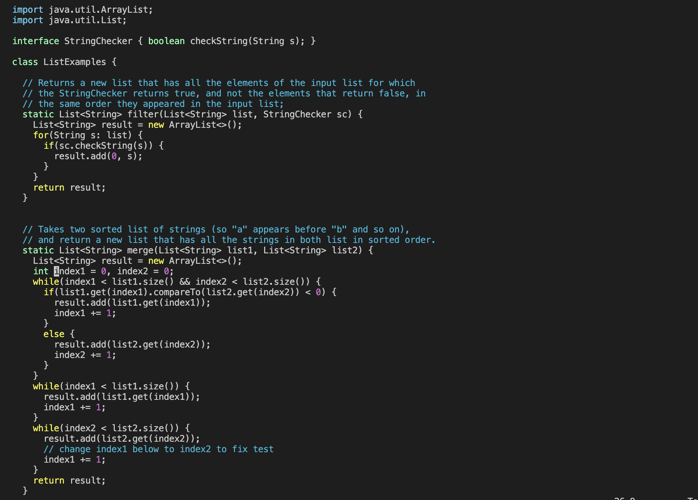
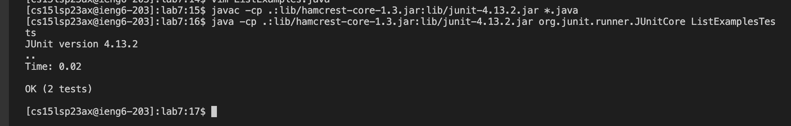

# Lab Report 4 

## Doing the steps 4 - 9 from the lab 
---
# Step 4: 

First we log into ssh and clone the new repository we have here

I had to loged in with my password as I didnt set up the ssh key yet

# Step 5 
 
Next I began to create the repository into my ieng6 account, one of the fastest ways I found to clone it was through searching the command history using `<ctrl><r>` together which then I proceeded to type 'git' which then popped up the 'git clone' command along with the link of the repository in in order to easily be able to clone the repository 

I pressed `<Enter>` and it started to clone the repository

After typing `ls` into the command line I was able to see that indeed lab 7 is there so now we have to change directories to get into the lab 7 directory itself by pressing `cd l<tab>` 

# Step 6

Checking to see the files in this directory by pressing `ls` we can see a bash script there, I had to check what was in the bash script by typing `less te<tab>`

I saw it both compiles and runs the junit test which is convenient knowing we can now just call this script to run the tests

Press `Q` in order to return back

now lets run the tests to see if it works 
typing in `bash te<tab>`

The error message says that in the ListExamples file there is an error there, at line 44 meaning we have to go fix it.

# Step 7

we then edit the file ListExamples file by accessing it in vim, we can do this by typing up `vim ListExamples.java` and we are in vim

we must first enter INSERT mode in vim by pressing `I`

Now We can trace where th e Ccrror is at line 44, so I pressed the `<down>` key 44 times

The comment in the code says to change the index1 variable to index2 so i proceeded to do that

Making sure to exit INSERT mode by pressing `<Escape>`, we can now exit by pressing `:wq` `<enter>` to exit vim and go back to terminal. to exit vim.

To make sure our changes are saved, we can always check by typing `less ListExamples.java`

# Step 8

Now lets try to run the test again, since we already used the bash script before, we can find it from our history by pressing `<ctrl><r><b>` which will autofill to `bash test.sh` when we press `<enter>`, We do so and here are the results 

The tests do indeed end up passing this time meaning we were able to fix our buggy code in the terminal itself

# Step 9

Our final step just needs us to commit the code to github

The first thing we must do is type `git add .<enter>` in order add all the changed files. Then type in `git commit -m "fix"<enter>` to commit the changes, and finally type `git push<enter>` to push the changes. But then it kept asking me for my Username and password, which I did but it did not allow me to push  the changes to the remote repository. That is the only issue that must be fixed here. Perhaps I didnt set it up correctly, but im not 100% sure
