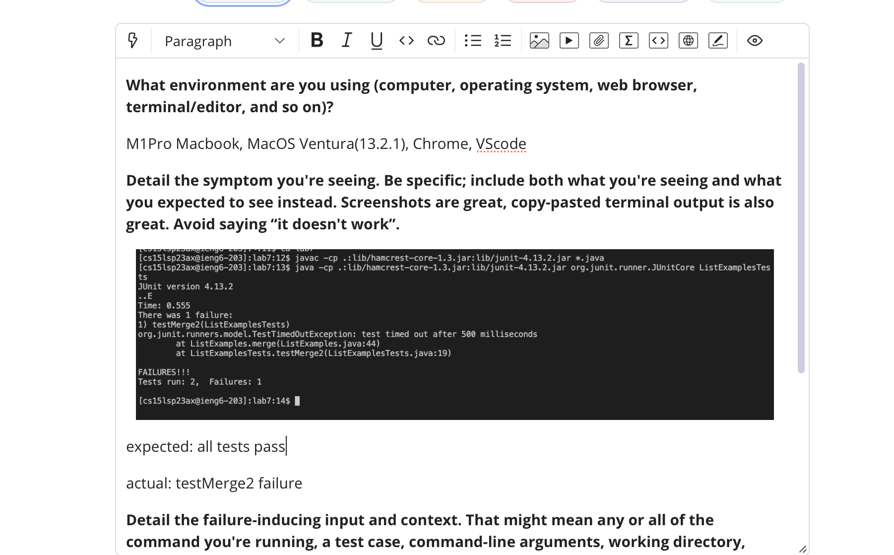
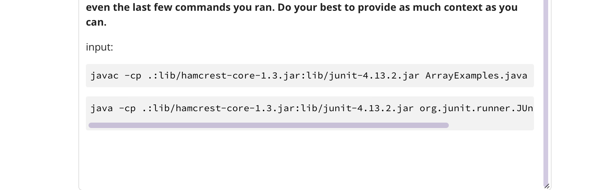
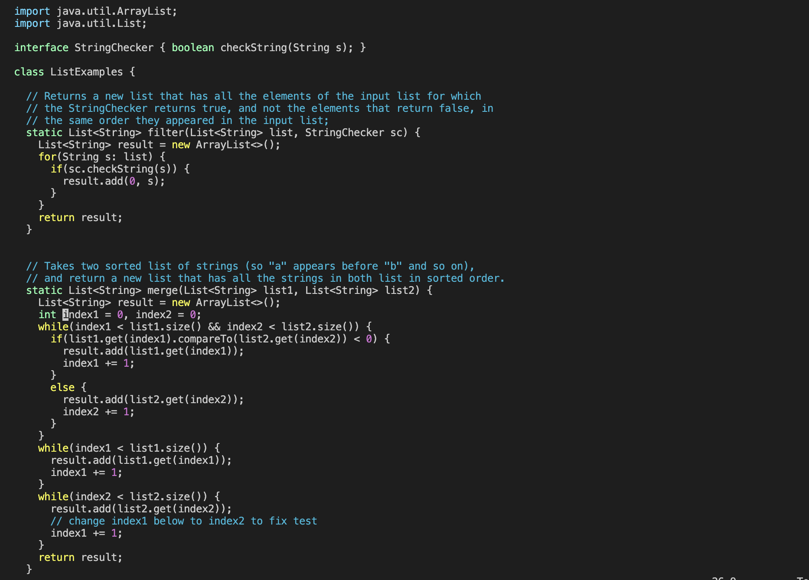
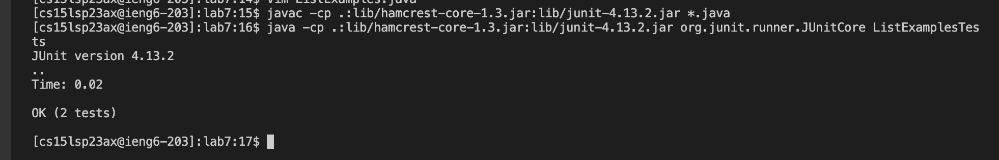

# Part 1: Debugging Scenario





###### Tutor's Response

Re: Debugging issue with ListExamples.java

Hello jordyn, I appreciate you reaching out for assistance. 
Today, I'll be aiding you in resolving this issue! 
Upon inspection, your ListExamples.java file seems to be in good shape. However, there appears to be an issue with your ListExamples.java code, particularly the reversed() method. Could you kindly share your complete ListExamples.java code? 

In the meantime, If executing these two commands each time you test feels burdensome, consider creating a bash script. Here's a sample bash script "listtest.sh":
```java
set -e
javac -cp .:lib/hamcrest-core-1.3.jar:lib/junit-4.13.2.jar Listexamples.java
java -cp .:lib/hamcrest-core-1.3.jar:lib/junit-4.13.2.jar org.junit.runner.JUnitCore ListTests
```
After running the bash script in your terminal, try: 
```java
bash-3.2$ echo $?
```
This command will return 1 if there's an error, or 0 if everything is fine. It's a quick way to see if there's an error or not.

Best Wishes, 

Nafi Mahbub.

###### Student's Response

Re: Issue with ListExamples.java 

Hello, its jordyn again heres the code for the ListExample Class


###### Tutor's Response

Re: Debugging issue with ListExamples.java

Hi Jordyn, as i expected the problem is with the code itself, look to find any bugs in the photo you sent me (hint: line 44).
After you find it you can edit it using vim by typing up `vim ListExamples.java` and entering INSERT mode by pressing `I`, as we learned in class.
After fixing the code run the tests again using the bash script.

###### Student's Response

Re: Issue with ListExamples.java

I found the issue, after replacing `index1` with `index2` the tests seem to run fine.

Thank you for all the help!


# Part 2: Reflection
One of the best parts of my time in the lab was when we learned about server.java and localhost. I didn't really know how to use Java code back then, so I asked the teaching assistants for a lot of help. But when I found out that I could change the URL and localhost server with Java code using VSCode, it felt awesome. That's when I started to enjoy coding and computer science even more. I was excited to learn new stuff like making an autograder, writing a bash script, learning about vim, and all that. This class and its lab were more useful than any other class I've taken before. I'm really thankful for all the helpful stuff we were taught.
